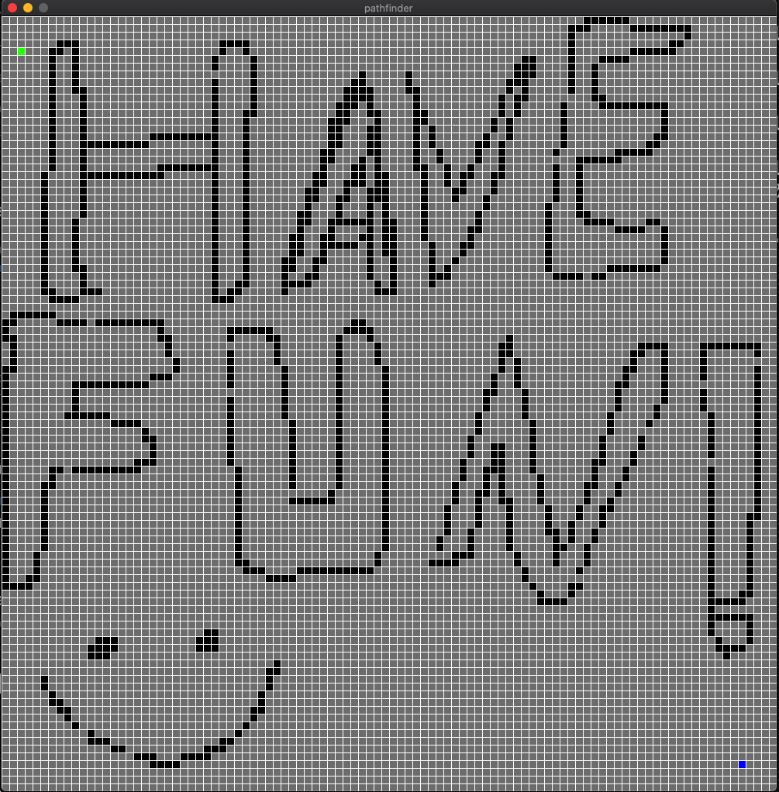
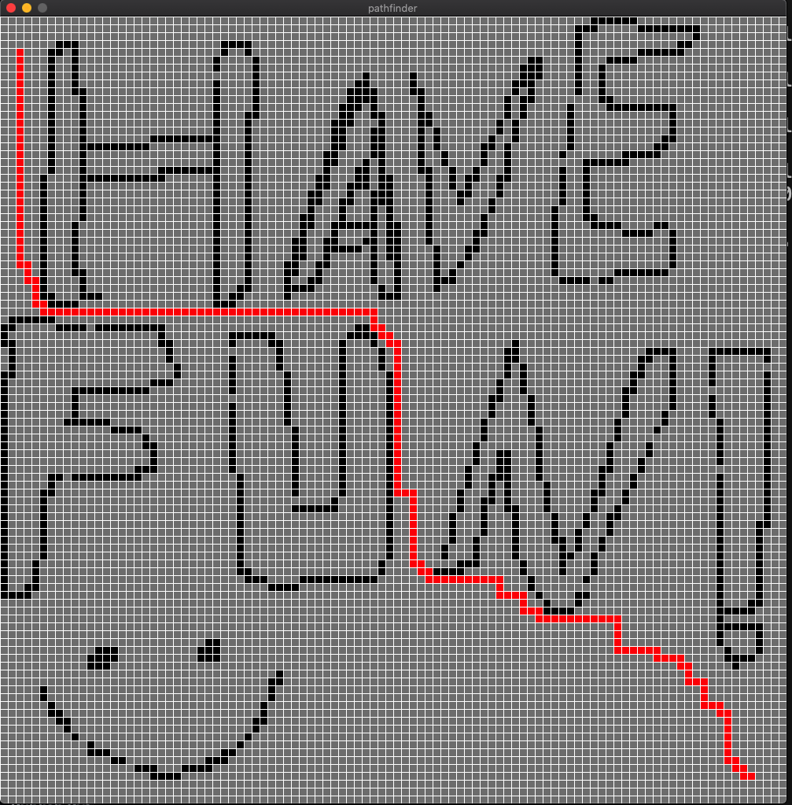
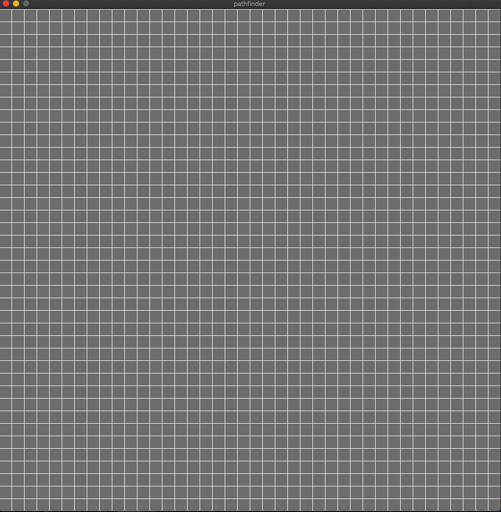
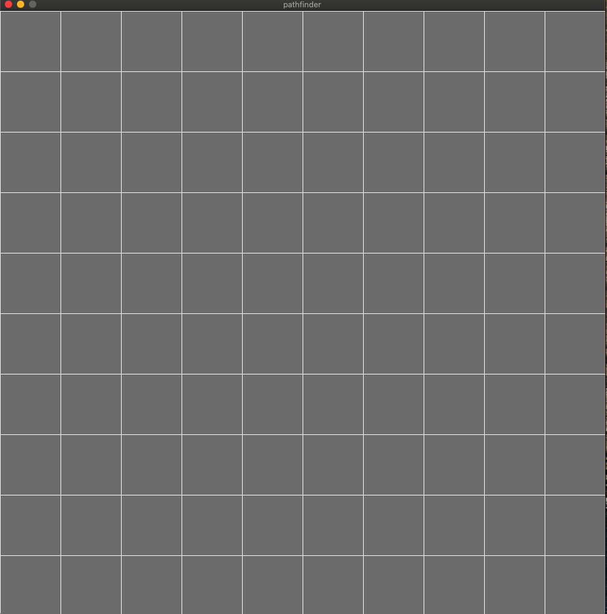

# Python Pathfinder with Dijkstra's Algorithm

This Python project implements a pathfinding algorithm using Dijkstra's algorithm to find the shortest path between two points in a maze-like environment. The maze is represented as a matrix, and the code comments within the repository provide detailed explanations of the implementation.

   
   

## Features

- **Maze as a Matrix**: The maze is represented as a matrix, where 1s denote open paths, and 0s denote walls.

- **Dijkstra's Algorithm**: Utilizes Dijkstra's algorithm to find the shortest path in the maze.

- **Real-time Visualization**: Visualize the maze, and final path in real-time using the Pygame library.

- **Interactive Maze Creation**: Create custom mazes by setting walls, start points, and destination points using a graphical interface.

- **Configurable Block Size**: Adjust the size of each grid block in the maze to create larger or smaller environments.

## Usage

To use this Python Pathfinder with Dijkstra's Algorithm, follow these steps:

1. **Set Start and End Positions**:
   - **Right-click** the mouse to set the **start position** (denoted in green) within the maze matrix.
   - **Right-click** the mouse again to set the **end position** (denoted in blue) within the maze matrix.

2. **Create Walls**:
   - **Right-click** the mouse for the third time to create walls (denoted in black) in the maze. You can continue creating walls by right-clicking as needed.

3. **Calculate Shortest Path**:
   - After setting the start and end positions and creating walls as desired, press the **Enter key** to calculate the shortest path using Dijkstra's algorithm.

4. **Restart the Maze (Optional)**:
   - To clear the maze and start over, press the **Delete key**.

Explore the matrix-based maze representation and observe the pathfinding process to find the shortest path between the start and end positions within the maze. Customize the maze by creating walls to define the path and challenge the algorithm.

  

## Getting Started

To run this Python Pathfinder with Dijkstra's Algorithm, follow these steps:

1. Clone the repository to your local machine
2. Navigate to the project directory
3. Install the required dependencies, including Pygame
5. To run just type: python3 main.py

## Example Blocksize
- **Blocksize 25 and Blocksize 100**

   
   

# License
This program is licensed under the MIT License. See the LICENSE file for more information.
